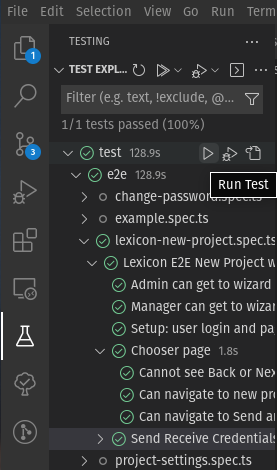
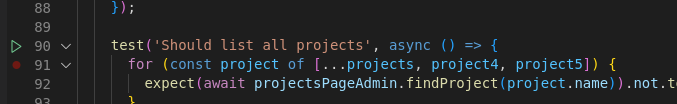

# Hanna's Playwright Cheatsheet
## Running the tests
### Most simple
- install VSCode Extension: *Playwright Test for VSCode*
- run tests directly with the extension in the side bar

- or run tests directly from the spec files

#### Debug tests
- debug tests by setting breakpoints in VSCode and select (right click on green triangle) *Debug Test*
### Simple
- `cd docker`
- `make playwright-tests`
This commands executes the playwright tests. Execution is specified in the makefile.
### More options
#### Setup
- `cd docker`
- `make`
- `cd ..`
- `npx playwright test`
#### Options
- run only a specific test file: `npx playwright test project.spec.ts`
- view how the tests are run: `npx playwright test --headed`
- step through the single lines, clicking *next* : `npx playwright test --debug`

### Essential to know
1. delete all *storageState.json* files before running the tests: `rm *storageState*`
1. not all tests will be executed but Playwright will indicate, e.g., *4 skipped*, *50 passed*
